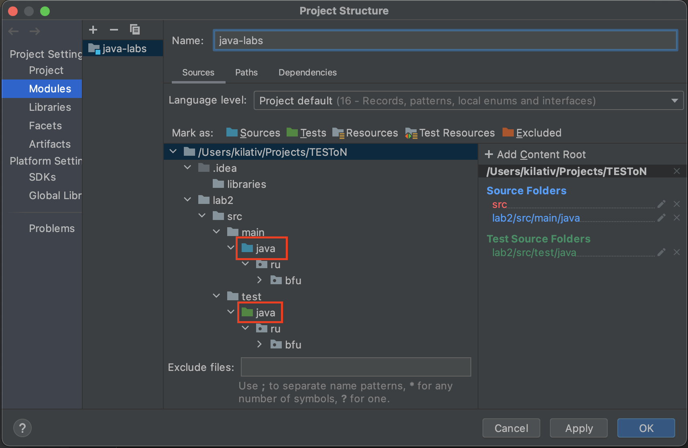

# Язык Java (Магистратура, 1 курс)

## Лабораторная работа № 2

В данной работе представлены задачи на работу с массивами, строками и матрицами в Java.
Помимо этого, мы рассмотрим основы тестирования кода с помощью фреймворка JUnit.

### Подготовка к выполнению задания

1. Не забудьте создать новую ветку в Git для новой лабораторной работы. Проверьте, что она синхронизирована с главной
   веткой ```main``` Вашего репозитория.
2. Скопируйте папку ```lab2``` в Ваш Git-репозиторий.
3. Обратите внимание на структуру проекта. Подобная структура
используется, например, в проектах Spring Boot.
Заметьте, что директория ```src``` содержит две поддиректории:
   * ```main``` (для исходного кода)
   * ```test``` (для тестирования)  

   Так как среда выполнения Java (JRE) позволяет работать с другими языками (например, Kotlin, Scala, Groovy), то папки
```main``` и ```test``` могут содержать код, написанный на разных языках. С этой целью в директориях ```main``` и
```test``` создается поддиректория ```java``` для исходного кода, написанного на Java. В этой поддиректории мы будем
размещать наши Java-пакеты (packages).
4. Дайте знать IntelliJ IDEA, что папка ```main/java``` содержит исходный код, а папка ```test/java``` содержит код для
тестирования. Это делается следующим образом:
   * Выберите на верхней панели File -> Project Structure -> Modules
   * Пометьте папку ```main/java``` как "Sources" (иконка с голубой папкой), а папку ```test/java``` как "Tests"
     (иконка с зеленой папкой):  
   
5. Подключите библиотеку JUnit к Вашему проекту, как описано [здесь](https://www.jetbrains.com/help/idea/testing.html#add-testing-libraries).
6. В папке ```test/java``` в пакете ```ru.bfu.ipmit.lab2``` находятся [юнит-тесты](https://www.jetbrains.com/help/idea/testing.html#add-testing-libraries).
Юнит-тесты являются неотъемлемой частью профессионального программирования. Вы можете запустить все юнит-тесты, нажав
правой кнопкой мыши на папку ```test/java```, а затем выбрав "Run 'All tests'". Ни один из тестов не должен быть успешен
до выполнения задания лабораторной работы № 2.

### Задание
1. Откройте класс ```Lab2``` в пакете ```ru.bfu.ipmit.lab2``` в папке с исходным кодом.
2. В классе ```Lab2``` представлены три метода с описанием в формате javadoc.
3. Реализуйте **как минимум два** из трех методов.
4. Запустите юнит-тесты для реализованных методов и проверьте, что они успешно выполняется.
5. Для каждого из реализованных методов добавьте еще несколько юнит-тестов, например, для граничных случаев
   (пустая строка, пустой массив и т.д.).
6. Создайте Pull Request для проверки.